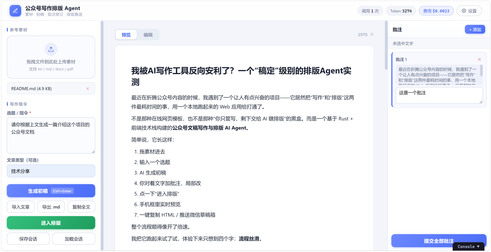
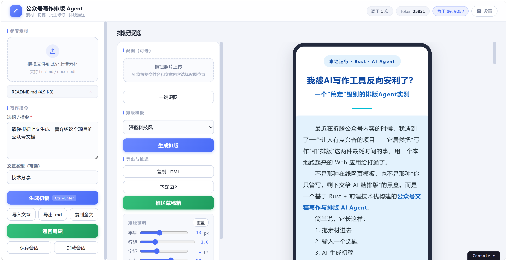

<div align="center">

# 🖋️ Draft2Press

**公众号写作排版智能体 —— 从素材起草，到一键发布草稿箱**

[](https://www.rust-lang.org)
[](LICENSE)
[](#)
[](https://github.com/tokio-rs/axum)

*从素材起草 → AI 写稿 → 批注定稿 → 排版美化 → 草稿箱发布，一条流水线完成公众号创作全流程*

</div>

---

## ✨ 产品特色

- 🪄 **一条流水线写作**：上传素材（txt / md / docx / pdf），全文自动进入 LLM 上下文作为知识库，AI 起草初稿
- 🖍️ **批注定稿**：选中任意文字添加批注意见，AI 弹出红删绿增的双栏 diff，逐条采纳——同类问题全文同步修正
- ⚡ **流式进度实时可见**：SSE 输出已生成字数与进度条，随时一键中断；失败自动回退非流式
- 🎨 **6 套排版模板**：蓝白 / 暖色 / 深色科技 / 节日红 / 黑白 / 清新绿，每套自带本地化贴纸动效；还能丢一段自然语言 + 推文链接让 **AI 生成新模板**
- 📏 **所见即所得排版**：手机框实时预览，字号 / 行距 / 字距 / 间距滑块即调即变，输出秀米/微信编辑器可直接粘贴的 HTML
- 📷 **照片 AI 识图**：配图描述自动生成，贴纸自动走微信素材上传
- 📮 **一键推送草稿箱**：标题 AI 自动生成，成品直达公众号后台
- 💰 **用量透明**：每次调用统计 token，USD/CNY 费用实时换算，预算上限自动中断

## 🖼️ 界面预览

**写作与批注修订**——左侧管理素材与写作指令，中间预览/编辑文章，右侧对选中文字添加批注做局部修订：



**排版预览**——选择模板、上传配图并 AI 识图，右侧手机框实时预览排版效果，可调节字号/行距等细节：



## 🚀 快速开始

```bash
# 1. 克隆并运行（Rust 1.97+）
git clone https://github.com/zhouzz25/draft2press.git
cd draft2press
cargo run -- --port 3000
```

浏览器打开 <http://localhost:3000>，点击右上角「设置」按钮填入 API Key 即可，所有配置均在网页端实时修改，无需重启。

> 💡 程序首次运行会自动创建 `.env` 文件；也可编辑 `.env` / `config.toml` 做文件级配置，但推荐直接在网页设置页操作。

### 环境要求

- Rust toolchain 1.97+（`rustup` 安装即可）
- 一个 OpenAI 兼容的 LLM API Key（DeepSeek / OpenAI / 任意兼容端点）
- （可选）微信公众号 AppID / AppSecret，用于草稿箱推送

## 🚀 使用流程

```text
① 上传素材          ② AI 生成初稿        ③ 批注定稿            ④ 排版发布
─────────────      ─────────────        ─────────────         ─────────────
拖拽 txt/md/docx    SSE 流式输出进度      选中文字→添加批注      选模板 / AI 识图
/pdf 到素材区       实时字数+进度条       双栏 diff 逐条采纳     滑块微调样式
作为知识库上下文     可随时中断停笔        同类问题全文同步修      HTML / ZIP / 草稿箱
```

- 拖拽上传素材 → 输入选题 → 点「生成初稿」，实时看到流式进度，不满意可随时中断
- 选中一段文字 → 添加批注 → 逐条处理：红删绿增 diff，接受/放弃/停止任你选择，可多轮迭代
- 「进入排版」→ 上传照片 AI 识图 → 选模板或让 AI 生成新模板 → 生成排版
- 滑块实时调节字号/行距/字距/间距 → 复制 HTML（贴纸 base64 内嵌）或直接推送草稿箱

## ⚙️ 配置说明

所有配置均可在 Web 设置页修改并自动持久化到 `config.toml`，也支持文件配置（可选）：

```toml
endpoint = "https://api.deepseek.com/chat/completions"
model = "deepseek-v4-flash"
context_length = 64000
max_tokens = 100000
temperature = 0.7

# Vision 模型（AI 识图，可选）
vision_model = "deepseek-v4-flash-vision-exp"
vision_max_tokens = 4000
vision_desc_max_chars = 30

# 微信公众号（推送草稿箱，可选）
wx_app_id = "your-app-id"
wx_app_secret = "your-app-secret"

# Token 预算（可选，达到上限自动中断）
token_budget = 100000

[pricing]
input_per_1k = 0.00027
output_per_1k = 0.0011
```

`.env` 文件：

```bash
API_KEY=sk-your-api-key
```

## 🏗️ 架构

```text
┌────────────────────────────────────────────────────┐
│  frontend/（原生 HTML + CSS + JS）                  │
│  素材上传 · 文章编辑 · 批注高亮 · 手机框预览 · 滑块   │
└──────────────────────┬─────────────────────────────┘
                       │ HTTP / SSE
┌──────────────────────▼─────────────────────────────┐
│  src/server.rs  axum 路由中枢                       │
│  ┌──────────┬──────────┬───────────┬─────────────┐ │
│  │ writer   │formatter │ wechat    │ cost        │ │
│  │ 写作/批注 │ 排版HTML  │ 公众号API │ token 计费  │ │
│  └────┬─────┴────┬─────┴─────┬─────┴──────┬──────┘ │
│       │  materials 素材解析│      llm  OpenAI 兼容│ │
└───────┴──────────┴───────────┴─────────────┴────────┘
```

| crate | 用途 |
|-------|------|
| axum | Web 服务器（SSE 流式响应、multipart 文件上传） |
| reqwest | HTTP 客户端（LLM / vision / 微信 API） |
| tokio + tokio-stream | 异步运行时 + SSE 流 |
| serde / serde_json | 序列化（API 响应、会话存取） |
| zip | docx 解析 + ZIP 打包下载 |
| pdf-extract | PDF 文本提取 |
| base64 | 图片编解码 |
| clap | CLI 参数（`--port`） |
| anyhow | 错误处理 |

## 📁 项目结构

```text
src/
  main.rs          # 入口（Web 服务）
  config.rs        # 模型/价格/vision/公众号/token预算 配置
  llm.rs           # OpenAI 兼容 LLM 客户端
  cost.rs          # Token 统计 + 成本换算
  materials.rs     # 素材解析（docx/pdf/txt/md）+ 分块
  writer.rs        # 写作 + 批注修订 prompt
  formatter.rs     # 排版 HTML 生成 + 清洗 + 模板选择
  wechat.rs        # 微信公众号 API（token/上传/草稿）
  server.rs        # axum 路由（SSE/会话/照片/排版/推送/ZIP）
frontend/          # 原生 HTML + CSS + JS 三文件
prompts/           # 外置 Prompt（改 prompt 不用重新编译）
  templates/       # 排版模板库（一模板一文件夹：template.md + assets/ 贴纸）
assets/            # README 截图
```

## 🧪 开发

```bash
cargo build                # 编译
cargo clippy -- -D warnings  # Lint
cargo test                 # 测试
cargo run -- --port 3000   # 启动 Web 服务
```

---

## 📢 声明

> 本项目为**清华大学程序设计训练课程作业**，仅供课程教学与个人学习交流使用。
> 项目开发过程采用 **AI 辅助编程（Vibe Coding）** 方式完成，部分代码由 AI 生成并经人工审查与测试。
> 项目中的设计与文字内容受保护，未经授权，任何单位或个人不得抄袭、转载或用于商业用途。相关权利人保留对侵权行为追究法律责任的权利。

---

## 📄 License

[MIT](LICENSE) © 2026 zhouzz25
